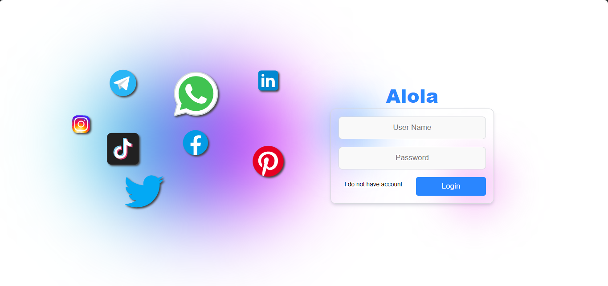
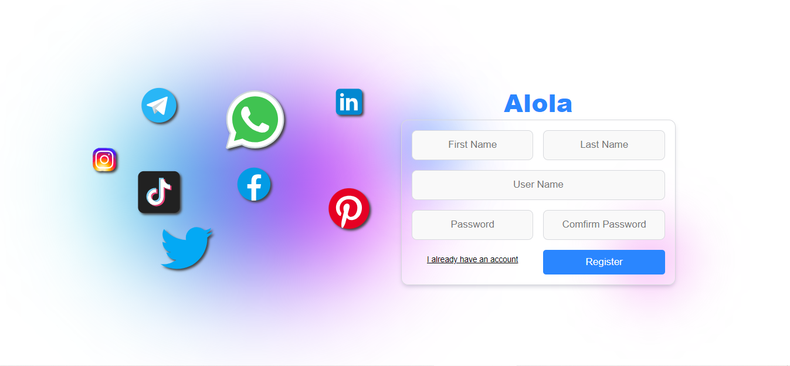
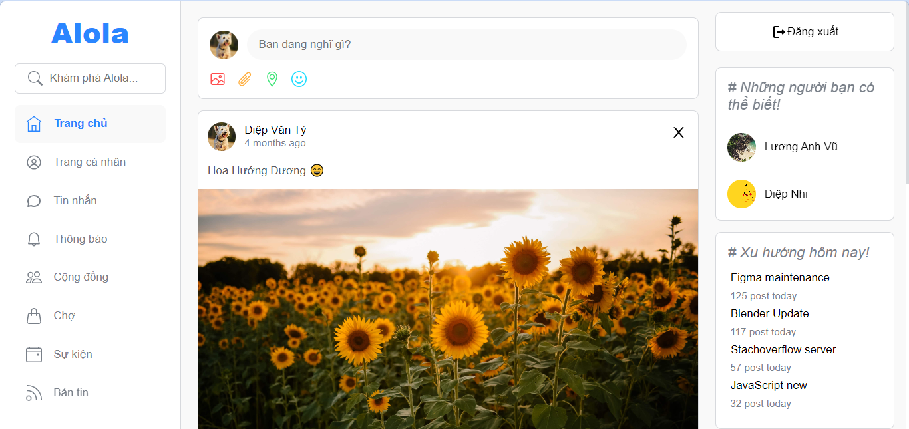
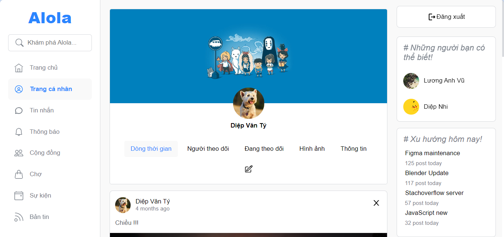
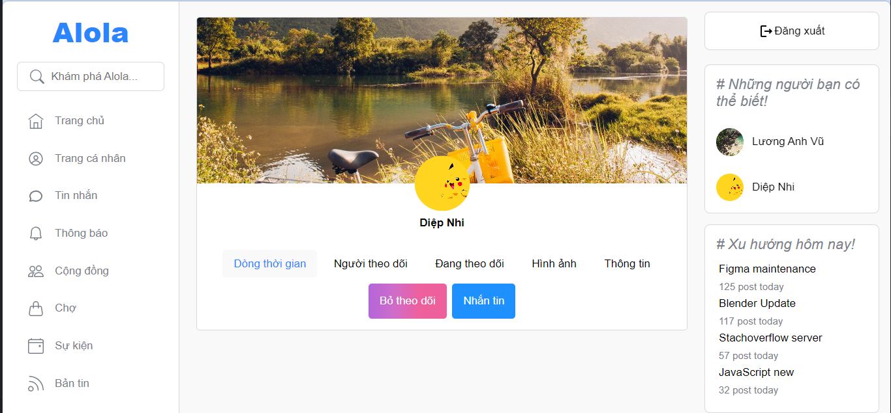
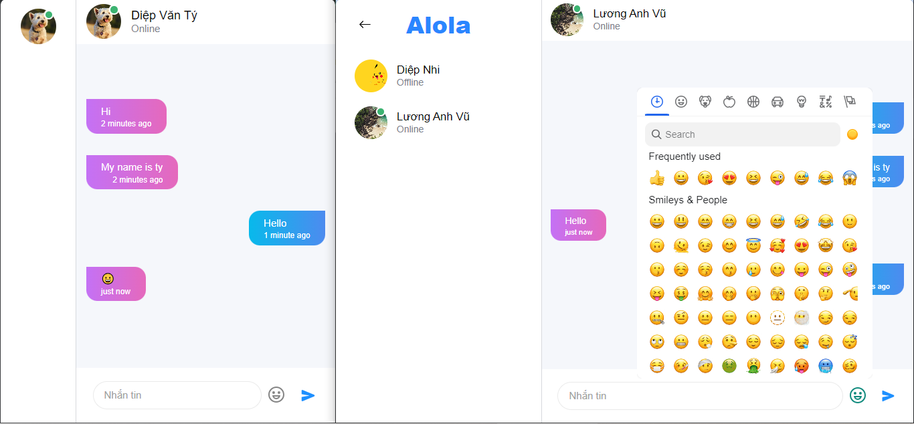

# Alola Social Media

## [Link website](https://alola-media.netlify.app/auth)

## UI

1. Auth page



2. Home page


3. Profile page



4. Chat page


## Project setup
```
npm install
```

## Create .env file
```
VITE_BASE_URL = "http://localhost:5000"
VITE_URI_LOGIN = "http://localhost:5000/auth/login"
VITE_URI_REGISTER = "http://localhost:5000/auth/register"
VITE_URI_UPLOAD = "http://localhost:5000/upload/"
VITE_URI_CHAT = "http://localhost:5000/chat"
VITE_URI_MESSAGE = "http://localhost:5000/message"
VITE_URI_POST = "http://localhost:5000/posts"
VITE_URI_USER = "http://localhost:5000/user"
VITE_PUBLIC_FOLDER = "http://localhost:5000/images/"
VITE_SOCKET = "http://localhost:8800"
```

## Server setup

1. [Web service](https://github.com/DiepVanTy-2409/social-media-server)
2. [Web socket](https://github.com/DiepVanTy-2409/social-media-socket)


## Run app
```
npm run dev
```